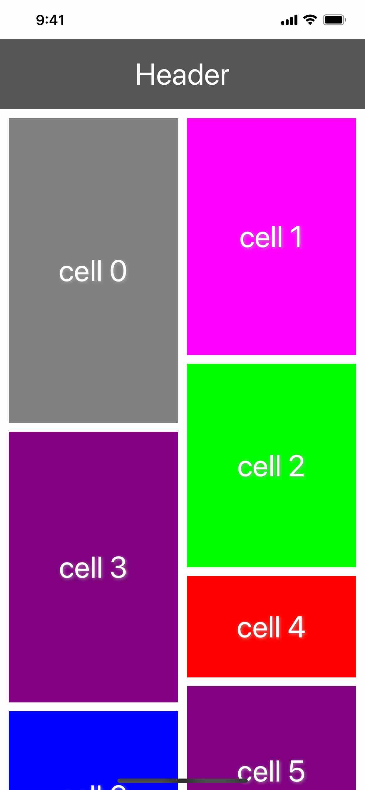

# WaterfallLayout

`WaterfallLayout` is a `UICollectionViewLayout` subclass for vertically laying out views like a waterfall, just like Pinterest app.

## Preview of the Example App

<div align="left">
    
</div>

## Requirements

Deployment target iOS 11.0+

## Installation

### Swift Package Manager

1. Xcode >  File > Swift Packages > Add Package Dependency
2. Add `https://github.com/Jinya/WaterfallLayout.git`
3. Select "Up to Next Minor" from "0.2.0"

## Usage

Once you've integrated the `WaterfallLayout` into your project, using it with a collection view is easy.

### Importing WaterfallLayout

At the top of the file where you'd like to use `WaterfallLayout` (likely `UIViewController` subclass).

```swift
import WaterfallLayout
```

### Setting up the collection view

Create your `UICollectionView` instance, passing in a `WaterfallLayout` instance for the layout parameter.

```swift
let layout = WaterfallLayout()
let collectionView = UICollectionView(frame: .zero, collectionViewLayout: layout)
```

Add `collectionView` to its superview, then properly constrain it using Auto Layout or manually set its `frame` property.

```swift
view.addSubview(collectionView)

collectionView.translatesAutoresizingMaskIntoConstraints = false

NSLayoutConstraint.activate([
    collectionView.leadingAnchor.constraint(equalTo: view.leadingAnchor),
    collectionView.trailingAnchor.constraint(equalTo: view.trailingAnchor),
    collectionView.topAnchor.constraint(equalTo: view.topAnchor),
    collectionView.bottomAnchor.constraint(equalTo: view.bottomAnchor),
])
```

### Registering cells and supplementary views

Register your cell and reusable view types with your collection view.

```swift
collectionView.register(MyCustomCell.self, forCellWithReuseIdentifier: "MyCustomCellReuseIdentifier")

// Only necessary if you want section headers
collectionView.register(MyCustomHeader.self, forSupplementaryViewOfKind: UICollectionView.SupplementaryViewKind.sectionHeader, withReuseIdentifier: "MyCustomHeaderReuseIdentifier")

// Only necessary if you want section footers
collectionView.register(MyCustomFooter.self, forSupplementaryViewOfKind: UICollectionView.SupplementaryViewKind.sectionFooter, withReuseIdentifier: "MyCustomFooterReuseIdentifier")
```

### Setting the data source

Now that you've registered your view types with your collection view, it's time to wire up the data source. Like with any collection view integration, your data source needs to conform to `UICollectionViewDataSource`. If the same object that owns your collection view is also your data source, you can simply do this:

```swift
collectionView.dataSource = self
```

### Configuring the delegate

Lastly, it's time to configure the layout to suit your needs. Like with `UICollectionViewFlowLayout` and `UICollectionViewDelegateFlowLayout`, `WaterfallLayout` configured its layout through its `UICollectionViewDelegateWaterfallLayout`.

To start configuring `WaterfallLayout`, set your collection view's `delegate` property to an object conforming to `UICollectionViewDelegateWaterfallLayout`. If the same object that owns your collection view is also your delegate, you can simply do this:

```swift
collectionView.delegate = self
```

Here's an example delegate implementation:

```swift
extension ViewController: UICollectionViewDelegateWaterfallLayout {
    func collectionView(_ collectionView: UICollectionView, layout collectionViewLayout: UICollectionViewLayout, numberOfColumnsInSection section: Int) -> Int {
        // You can dynamically configure the number of columns in a section here, e.g., depending on the horizontal size of the collection view.
        return traitCollection.horizontalSizeClass == .compact ? 2 : 4
    }

    func collectionView(_ collectionView: UICollectionView, layout collectionViewLayout: UICollectionViewLayout, sizeForItemAt indexPath: IndexPath) -> CGSize {
        // Here to configure size for every cell.
    }

    func collectionView(_ collectionView: UICollectionView, layout collectionViewLayout: UICollectionViewLayout, insetForSectionAt section: Int) -> UIEdgeInsets {
        return .init(top: 10, left: 10, bottom: 10, right: 10)
    }

    func collectionView(_ collectionView: UICollectionView, layout collectionViewLayout: UICollectionViewLayout, minimumColumnSpacingForSectionAt section: Int) -> CGFloat {
        return 10
    }

    func collectionView(_ collectionView: UICollectionView, layout collectionViewLayout: UICollectionViewLayout, minimumInteritemSpacingForSectionAt section: Int) -> CGFloat {
        return 10
    }

    func collectionView(_ collectionView: UICollectionView, layout collectionViewLayout: UICollectionViewLayout, referenceSizeForHeaderInSection section: Int) -> CGSize {
        return .init(width: collectionView.bounds.width, height: 80)
    }

    func collectionView(_ collectionView: UICollectionView, layout collectionViewLayout: UICollectionViewLayout, referenceSizeForFooterInSection section: Int) -> CGSize {
        return .init(width: collectionView.bounds.width, height: 80)
    }
}
```

If you've followed the steps above, you should have a working `UICollectionView` using `WaterfallLayout`! If you'd like to work with a pre-made example, check out the included example project.

## MIT License

WaterfallLayout released under the MIT license. See LICENSE for details.

## Acknowledgement

`WaterfallLayout` was heavily inspired by [`CHTCollectionViewWaterfallLayout`](https://github.com/chiahsien/CHTCollectionViewWaterfallLayout.git).
